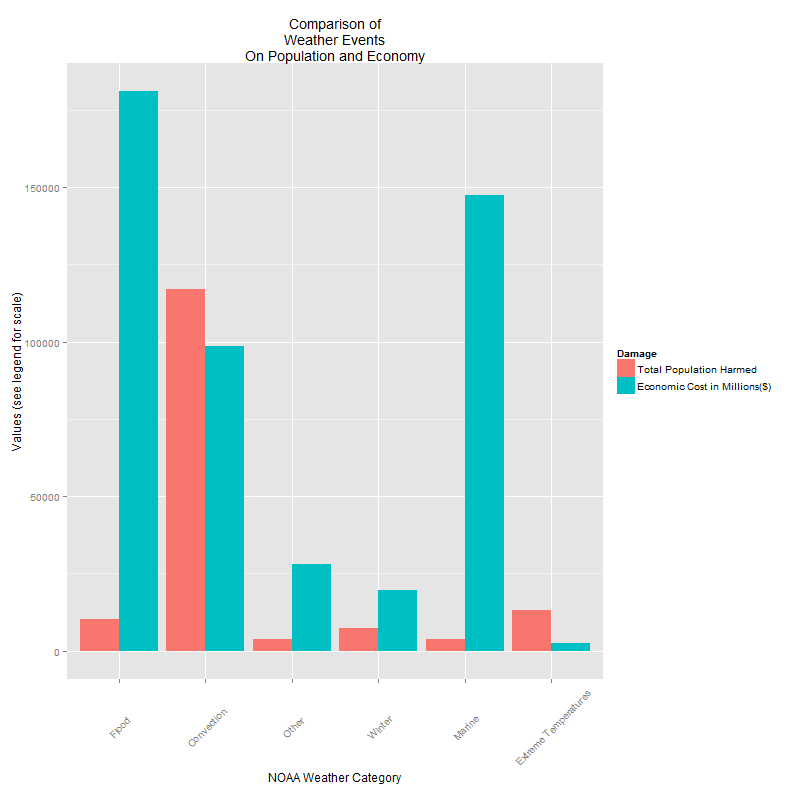
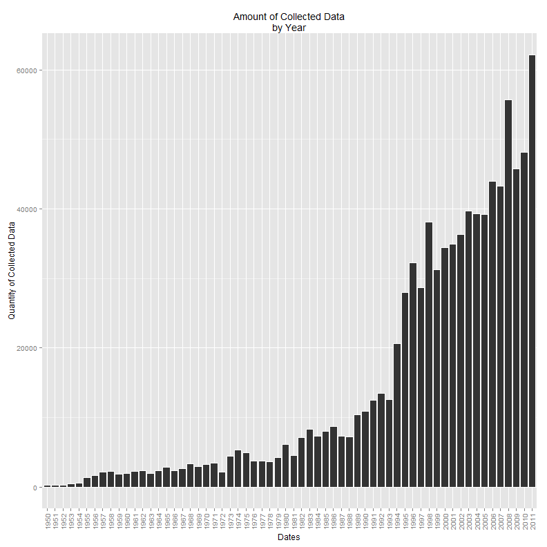

Severe Weather Analysis (1950-2011)
========================================================
The following will be an analysis of the damage caused by severe weather events from the years of 1950 through 2011.  The original raw data classified individual weather events in several different ways, varying in spelling and terminology for similiar events.  The bulk of the analysis will be the methodology used to classify the 985 different event types over 61 years into 6 categories.  The analysis will look at damage to the population and economy between these different categories as well the amount of data gathered from year to year to give an understanding of what years influenced the data the most.

## Data Preprocessing

```r
library(scales)
library(ggplot2)
library(reshape2)
```


```r
## Loading Raw Data File from .bz2 format
data <- read.csv("repdata-data-StormData.csv.bz2", stringsAsFactors = F)
```

One of the steps in creating a tidier dataset was to categorize the several event-types (column **EVETYPE**).

```r
length(unique(data$EVTYPE))  ## Different event types
```

```
## [1] 985
```

There are 985 types of weather events being classified in the raw data.  According to the Summary of Natural Hazard Statistics for 2009 from the NOAA database, these serperate types, for the sake of this analysis, can be categorized into 7 groups which will make the analysis more concise and readable.  The categories Marine and Tropical Cyclones were combined into one - Marine - because of their close relationship and the low amount of data for each, which makes the total 6 categories.  The link can be found here.
http://www.ncdc.noaa.gov/oa/climate/sd/annsum2009.pdf

### The following code shall represent the categorization code required for concise representation of the 985 weather types.

```r
events <- as.factor(data$EVTYPE)  ## Made a factor vector of the events column
events.backup <- events  ## made a backup
```

The 7 categories for Weather Events are
 1. **Convection:** *Lighting; Tornado; Thunderstorm Wind; Hail*
 2. **Extreme:** *Temperatures: Cold; Heat*
 3. **Flood:** *Flash Flood; River Flood*
 4. **Marine:** *Coastal Storm; Tsunami; Rip Current;Tropical Storm / Hurricane*
 5. **Winter:** *Winter Storm; Ice; Avalanche*
 6. **Other:** *Drought; Dust Storm; Dust Devil; Rain*
        (Unidentified types were also classified in this category)
        
The following codes will be sorted by each category.  Each section will have 2 areas.  The first part will show the specific **EVTYPE** being categorized.  The second part will show the code implemented to categorize them. Each **EVTYPE** went through an initial visual categorization.  This visual method is subject to human error, of course.  Anything missed by the initial categorization was categorized after the intial 7 sections.  This is possible because once an **EVTYPE** is categorized, it will only appear as the category name (ex. "Convection"), which will make the remaining **EVTYPE** easier to visually sift.  The group *Other* has a high variance in weather types, ranging from Rain-Volvanic Ash-etc.  *Other*, however, has a much smaller influence in the end data.

#### Convection

```r
## These are the Types I chose to include in the Convection category
levels(events)[c(4:6, 8, 64:66, 214:220, 225:228, 231:272, 347, 358:395, 463:476, 
    491:494, 524, 605, 607, 615:617, 675:680, 748:750, 754, 758, 759:830, 834:844, 
    855:876, 878, 930, 931, 932, 952, 953, 959:970, 985)]
```

```
##   [1] " LIGHTNING"                     " TSTM WIND"                    
##   [3] " TSTM WIND (G45)"               " WIND"                         
##   [5] "COASTALSTORM"                   "Cold"                          
##   [7] "COLD"                           "FUNNEL"                        
##   [9] "Funnel Cloud"                   "FUNNEL CLOUD"                  
##  [11] "FUNNEL CLOUD."                  "FUNNEL CLOUD/HAIL"             
##  [13] "FUNNEL CLOUDS"                  "FUNNELS"                       
##  [15] "gradient wind"                  "Gradient wind"                 
##  [17] "GRADIENT WIND"                  "GRADIENT WINDS"                
##  [19] "GUSTNADO"                       "GUSTNADO AND"                  
##  [21] "GUSTY LAKE WIND"                "GUSTY THUNDERSTORM WIND"       
##  [23] "GUSTY THUNDERSTORM WINDS"       "Gusty Wind"                    
##  [25] "GUSTY WIND"                     "GUSTY WIND/HAIL"               
##  [27] "GUSTY WIND/HVY RAIN"            "Gusty wind/rain"               
##  [29] "Gusty winds"                    "Gusty Winds"                   
##  [31] "GUSTY WINDS"                    "HAIL"                          
##  [33] "HAIL 0.75"                      "HAIL 0.88"                     
##  [35] "HAIL 075"                       "HAIL 088"                      
##  [37] "HAIL 1.00"                      "HAIL 1.75"                     
##  [39] "HAIL 1.75)"                     "HAIL 100"                      
##  [41] "HAIL 125"                       "HAIL 150"                      
##  [43] "HAIL 175"                       "HAIL 200"                      
##  [45] "HAIL 225"                       "HAIL 275"                      
##  [47] "HAIL 450"                       "HAIL 75"                       
##  [49] "HAIL 80"                        "HAIL 88"                       
##  [51] "HAIL ALOFT"                     "HAIL DAMAGE"                   
##  [53] "HAIL FLOODING"                  "HAIL STORM"                    
##  [55] "Hail(0.75)"                     "HAIL/ICY ROADS"                
##  [57] "HAIL/WIND"                      "HAIL/WINDS"                    
##  [59] "HAILSTORM"                      "HAILSTORMS"                    
##  [61] "HIGH  WINDS"                    "High Wind"                     
##  [63] "HIGH WIND"                      "HIGH WIND (G40)"               
##  [65] "HIGH WIND 48"                   "HIGH WIND 63"                  
##  [67] "HIGH WIND 70"                   "HIGH WIND AND HEAVY SNOW"      
##  [69] "HIGH WIND AND HIGH TIDES"       "HIGH WIND AND SEAS"            
##  [71] "HIGH WIND DAMAGE"               "HIGH WIND/ BLIZZARD"           
##  [73] "HIGH WIND/BLIZZARD"             "HIGH WIND/BLIZZARD/FREEZING RA"
##  [75] "HIGH WIND/HEAVY SNOW"           "HIGH WIND/LOW WIND CHILL"      
##  [77] "HIGH WIND/SEAS"                 "HIGH WIND/WIND CHILL"          
##  [79] "HIGH WIND/WIND CHILL/BLIZZARD"  "HIGH WINDS"                    
##  [81] "HIGH WINDS 55"                  "HIGH WINDS 57"                 
##  [83] "HIGH WINDS 58"                  "HIGH WINDS 63"                 
##  [85] "HIGH WINDS 66"                  "HIGH WINDS 67"                 
##  [87] "HIGH WINDS 73"                  "HIGH WINDS 76"                 
##  [89] "HIGH WINDS 80"                  "HIGH WINDS 82"                 
##  [91] "HIGH WINDS AND WIND CHILL"      "HIGH WINDS DUST STORM"         
##  [93] "HIGH WINDS HEAVY RAINS"         "HIGH WINDS/"                   
##  [95] "HIGH WINDS/COASTAL FLOOD"       "HIGH WINDS/COLD"               
##  [97] "HIGH WINDS/FLOODING"            "HIGH WINDS/HEAVY RAIN"         
##  [99] "HIGH WINDS/SNOW"                "LIGHTING"                      
## [101] "LIGHTNING"                      "LIGHTNING  WAUSEON"            
## [103] "LIGHTNING AND HEAVY RAIN"       "LIGHTNING AND THUNDERSTORM WIN"
## [105] "LIGHTNING AND WINDS"            "LIGHTNING DAMAGE"              
## [107] "LIGHTNING FIRE"                 "LIGHTNING INJURY"              
## [109] "LIGHTNING THUNDERSTORM WINDS"   "LIGHTNING THUNDERSTORM WINDSS" 
## [111] "LIGHTNING."                     "LIGHTNING/HEAVY RAIN"          
## [113] "LIGNTNING"                      "Metro Storm, May 26"           
## [115] "Microburst"                     "MICROBURST"                    
## [117] "MICROBURST WINDS"               "NON-SEVERE WIND DAMAGE"        
## [119] "SEVERE THUNDERSTORM WINDS"      "SEVERE TURBULENCE"             
## [121] "small hail"                     "Small Hail"                    
## [123] "SMALL HAIL"                     "Strong Wind"                   
## [125] "STRONG WIND"                    "STRONG WIND GUST"              
## [127] "Strong winds"                   "Strong Winds"                  
## [129] "STRONG WINDS"                   "THUDERSTORM WINDS"             
## [131] "THUNDEERSTORM WINDS"            "THUNDERESTORM WINDS"           
## [133] "THUNDERSTORM  WINDS"            "THUNDERSTORM W INDS"           
## [135] "Thunderstorm Wind"              "THUNDERSTORM WIND"             
## [137] "THUNDERSTORM WIND (G40)"        "THUNDERSTORM WIND 50"          
## [139] "THUNDERSTORM WIND 52"           "THUNDERSTORM WIND 56"          
## [141] "THUNDERSTORM WIND 59"           "THUNDERSTORM WIND 59 MPH"      
## [143] "THUNDERSTORM WIND 59 MPH."      "THUNDERSTORM WIND 60 MPH"      
## [145] "THUNDERSTORM WIND 65 MPH"       "THUNDERSTORM WIND 65MPH"       
## [147] "THUNDERSTORM WIND 69"           "THUNDERSTORM WIND 98 MPH"      
## [149] "THUNDERSTORM WIND G50"          "THUNDERSTORM WIND G51"         
## [151] "THUNDERSTORM WIND G52"          "THUNDERSTORM WIND G55"         
## [153] "THUNDERSTORM WIND G60"          "THUNDERSTORM WIND G61"         
## [155] "THUNDERSTORM WIND TREES"        "THUNDERSTORM WIND."            
## [157] "THUNDERSTORM WIND/ TREE"        "THUNDERSTORM WIND/ TREES"      
## [159] "THUNDERSTORM WIND/AWNING"       "THUNDERSTORM WIND/HAIL"        
## [161] "THUNDERSTORM WIND/LIGHTNING"    "THUNDERSTORM WINDS"            
## [163] "THUNDERSTORM WINDS      LE CEN" "THUNDERSTORM WINDS 13"         
## [165] "THUNDERSTORM WINDS 2"           "THUNDERSTORM WINDS 50"         
## [167] "THUNDERSTORM WINDS 52"          "THUNDERSTORM WINDS 53"         
## [169] "THUNDERSTORM WINDS 60"          "THUNDERSTORM WINDS 61"         
## [171] "THUNDERSTORM WINDS 62"          "THUNDERSTORM WINDS 63 MPH"     
## [173] "THUNDERSTORM WINDS AND"         "THUNDERSTORM WINDS FUNNEL CLOU"
## [175] "THUNDERSTORM WINDS G"           "THUNDERSTORM WINDS G60"        
## [177] "THUNDERSTORM WINDS HAIL"        "THUNDERSTORM WINDS HEAVY RAIN" 
## [179] "THUNDERSTORM WINDS LIGHTNING"   "THUNDERSTORM WINDS SMALL STREA"
## [181] "THUNDERSTORM WINDS URBAN FLOOD" "THUNDERSTORM WINDS."           
## [183] "THUNDERSTORM WINDS/ FLOOD"      "THUNDERSTORM WINDS/ HAIL"      
## [185] "THUNDERSTORM WINDS/FLASH FLOOD" "THUNDERSTORM WINDS/FLOODING"   
## [187] "THUNDERSTORM WINDS/FUNNEL CLOU" "THUNDERSTORM WINDS/HAIL"       
## [189] "THUNDERSTORM WINDS/HEAVY RAIN"  "THUNDERSTORM WINDS53"          
## [191] "THUNDERSTORM WINDSHAIL"         "THUNDERSTORM WINDSS"           
## [193] "THUNDERSTORM WINS"              "THUNDERSTORMS"                 
## [195] "THUNDERSTORMS WIND"             "THUNDERSTORMS WINDS"           
## [197] "THUNDERSTORMW"                  "THUNDERSTORMW 50"              
## [199] "THUNDERSTORMW WINDS"            "THUNDERSTORMWINDS"             
## [201] "THUNDERSTROM WIND"              "THUNDERSTROM WINDS"            
## [203] "THUNDERTORM WINDS"              "THUNDERTSORM WIND"             
## [205] "THUNDESTORM WINDS"              "THUNERSTORM WINDS"             
## [207] "TORNADO"                        "TORNADO DEBRIS"                
## [209] "TORNADO F0"                     "TORNADO F1"                    
## [211] "TORNADO F2"                     "TORNADO F3"                    
## [213] "TORNADO/WATERSPOUT"             "TORNADOES"                     
## [215] "TORNADOES, TSTM WIND, HAIL"     "TORNADOS"                      
## [217] "TORNDAO"                        "Tstm Wind"                     
## [219] "TSTM WIND"                      "TSTM WIND  (G45)"              
## [221] "TSTM WIND (41)"                 "TSTM WIND (G35)"               
## [223] "TSTM WIND (G40)"                "TSTM WIND (G45)"               
## [225] "TSTM WIND 40"                   "TSTM WIND 45"                  
## [227] "TSTM WIND 50"                   "TSTM WIND 51"                  
## [229] "TSTM WIND 52"                   "TSTM WIND 55"                  
## [231] "TSTM WIND 65)"                  "TSTM WIND AND LIGHTNING"       
## [233] "TSTM WIND DAMAGE"               "TSTM WIND G45"                 
## [235] "TSTM WIND G58"                  "TSTM WIND/HAIL"                
## [237] "TSTM WINDS"                     "TSTM WND"                      
## [239] "TSTMW"                          "TUNDERSTORM WIND"              
## [241] "WAKE LOW WIND"                  "WALL CLOUD"                    
## [243] "WALL CLOUD/FUNNEL CLOUD"        "Whirlwind"                     
## [245] "WHIRLWIND"                      "Wind"                          
## [247] "WIND"                           "WIND ADVISORY"                 
## [249] "WIND AND WAVE"                  "WIND CHILL"                    
## [251] "WIND CHILL/HIGH WIND"           "Wind Damage"                   
## [253] "WIND DAMAGE"                    "WIND GUSTS"                    
## [255] "WIND STORM"                     "WIND/HAIL"                     
## [257] "WINDS"                          "WND"
```

```r
## Adding to group
levels(events)[c(4:6, 8, 64:66, 214:220, 225:228, 231:272, 347, 358:395, 463:476, 
    491:494, 524, 605, 607, 615:617, 675:680, 748:750, 754, 758, 759:830, 834:844, 
    855:876, 878, 930, 931, 932, 952, 953, 959:970, 985)] <- "Convection"
```

#### Extreme Temperatures

```r
## These are the Types I chose to include in the Extreme Temperatures
## category
levels(events)[c(61:76, 122:143, 216:223, 299:303, 315:318, 368:370, 418:421, 
    431:463, 467, 486, 641:659, 684, 692)]
```

```
##   [1] "COLD AIR FUNNEL"                "COLD AIR FUNNELS"              
##   [3] "COLD AIR TORNADO"               "Cold and Frost"                
##   [5] "COLD AND FROST"                 "COLD AND SNOW"                 
##   [7] "COLD AND WET CONDITIONS"        "Cold Temperature"              
##   [9] "COLD TEMPERATURES"              "COLD WAVE"                     
##  [11] "COLD WEATHER"                   "COLD WIND CHILL TEMPERATURES"  
##  [13] "COLD/WIND CHILL"                "COLD/WINDS"                    
##  [15] "COOL AND WET"                   "COOL SPELL"                    
##  [17] "EXCESSIVE"                      "Excessive Cold"                
##  [19] "EXCESSIVE HEAT"                 "EXCESSIVE HEAT/DROUGHT"        
##  [21] "EXCESSIVE PRECIPITATION"        "EXCESSIVE RAIN"                
##  [23] "EXCESSIVE RAINFALL"             "EXCESSIVE SNOW"                
##  [25] "EXCESSIVE WETNESS"              "EXCESSIVELY DRY"               
##  [27] "Extended Cold"                  "Extreme Cold"                  
##  [29] "EXTREME COLD"                   "EXTREME COLD/WIND CHILL"       
##  [31] "EXTREME HEAT"                   "EXTREME WIND CHILL"            
##  [33] "EXTREME WIND CHILL/BLOWING SNO" "EXTREME WIND CHILLS"           
##  [35] "EXTREME WINDCHILL"              "EXTREME WINDCHILL TEMPERATURES"
##  [37] "EXTREME/RECORD COLD"            "EXTREMELY WET"                 
##  [39] "HEAT"                           "HEAT DROUGHT"                  
##  [41] "Heat Wave"                      "HEAT WAVE"                     
##  [43] "HEAT WAVE DROUGHT"              "HEAT WAVES"                    
##  [45] "HEAT/DROUGHT"                   "Heatburst"                     
##  [47] "Hot and Dry"                    "HOT PATTERN"                   
##  [49] "HOT SPELL"                      "HOT WEATHER"                   
##  [51] "HOT/DRY PATTERN"                "HYPERTHERMIA/EXPOSURE"         
##  [53] "HYPOTHERMIA"                    "Hypothermia/Exposure"          
##  [55] "HYPOTHERMIA/EXPOSURE"           "LOW TEMPERATURE"               
##  [57] "LOW TEMPERATURE RECORD"         "LOW WIND CHILL"                
##  [59] "Prolong Cold"                   "PROLONG COLD"                  
##  [61] "PROLONG COLD/SNOW"              "PROLONG WARMTH"                
##  [63] "RECORD  COLD"                   "Record Cold"                   
##  [65] "RECORD COLD"                    "RECORD COLD AND HIGH WIND"     
##  [67] "RECORD COLD/FROST"              "RECORD COOL"                   
##  [69] "Record dry month"               "RECORD DRYNESS"                
##  [71] "Record Heat"                    "RECORD HEAT"                   
##  [73] "RECORD HEAT WAVE"               "Record High"                   
##  [75] "RECORD HIGH"                    "RECORD HIGH TEMPERATURE"       
##  [77] "RECORD HIGH TEMPERATURES"       "RECORD LOW"                    
##  [79] "RECORD LOW RAINFALL"            "Record May Snow"               
##  [81] "RECORD PRECIPITATION"           "RECORD RAINFALL"               
##  [83] "RECORD SNOW"                    "RECORD SNOW/COLD"              
##  [85] "RECORD SNOWFALL"                "Record temperature"            
##  [87] "RECORD TEMPERATURE"             "Record Temperatures"           
##  [89] "RECORD TEMPERATURES"            "RECORD WARM"                   
##  [91] "RECORD WARM TEMPS."             "Record Warmth"                 
##  [93] "RECORD WARMTH"                  "Record Winter Snow"            
##  [95] "RECORD/EXCESSIVE HEAT"          "REMNANTS OF FLOYD"             
##  [97] "SEVERE COLD"                    "Unseasonable Cold"             
##  [99] "UNSEASONABLY COLD"              "UNSEASONABLY COOL"             
## [101] "UNSEASONABLY COOL & WET"        "UNSEASONABLY DRY"              
## [103] "UNSEASONABLY HOT"               "UNSEASONABLY WARM"             
## [105] "UNSEASONABLY WARM & WET"        "UNSEASONABLY WARM AND DRY"     
## [107] "UNSEASONABLY WARM YEAR"         "UNSEASONABLY WARM/WET"         
## [109] "UNSEASONABLY WET"               "UNSEASONAL LOW TEMP"           
## [111] "UNSEASONAL RAIN"                "UNUSUAL WARMTH"                
## [113] "UNUSUAL/RECORD WARMTH"          "UNUSUALLY COLD"                
## [115] "UNUSUALLY LATE SNOW"            "UNUSUALLY WARM"                
## [117] "VERY WARM"                      "WARM WEATHER"
```

```r
## Adding to group
levels(events)[c(61:76, 122:143, 216:223, 299:303, 315:318, 368:370, 418:421, 
    431:463, 467, 486, 641:659, 684, 692)] <- "Extreme Temperatures"
```

#### Flood

```r
## The groups included in the category Flood
levels(events)[c(1:3, 21, 45, 48, 50, 51, 52, 53, 54, 55, 59, 60, 63, 64, 106, 
    110:144, 187, 197, 199, 202, 253, 289, 290, 291, 292, 293, 294, 311:314, 
    325, 326, 327, 340:348, 377:381, 386, 400:408, 454, 455, 456, 530, 531, 
    532, 545:567)]
```

```
##   [1] "   HIGH SURF ADVISORY"          " COASTAL FLOOD"                
##   [3] " FLASH FLOOD"                   "BEACH FLOOD"                   
##   [5] "BREAKUP FLOODING"               "COASTAL  FLOODING/EROSION"     
##   [7] "Coastal Flood"                  "COASTAL FLOOD"                 
##   [9] "coastal flooding"               "Coastal Flooding"              
##  [11] "COASTAL FLOODING"               "COASTAL FLOODING/EROSION"      
##  [13] "COASTAL/TIDAL FLOOD"            "COASTALFLOOD"                  
##  [15] "DAM BREAK"                      "DAM FAILURE"                   
##  [17] "Erosion/Cstl Flood"             "FLASH FLOOD"                   
##  [19] "FLASH FLOOD - HEAVY RAIN"       "FLASH FLOOD FROM ICE JAMS"     
##  [21] "FLASH FLOOD LANDSLIDES"         "FLASH FLOOD WINDS"             
##  [23] "FLASH FLOOD/"                   "FLASH FLOOD/ FLOOD"            
##  [25] "FLASH FLOOD/ STREET"            "FLASH FLOOD/FLOOD"             
##  [27] "FLASH FLOOD/HEAVY RAIN"         "FLASH FLOOD/LANDSLIDE"         
##  [29] "FLASH FLOODING"                 "FLASH FLOODING/FLOOD"          
##  [31] "FLASH FLOODING/THUNDERSTORM WI" "FLASH FLOODS"                  
##  [33] "FLASH FLOOODING"                "Flood"                         
##  [35] "FLOOD"                          "FLOOD & HEAVY RAIN"            
##  [37] "FLOOD FLASH"                    "FLOOD FLOOD/FLASH"             
##  [39] "FLOOD WATCH/"                   "FLOOD/FLASH"                   
##  [41] "Flood/Flash Flood"              "FLOOD/FLASH FLOOD"             
##  [43] "FLOOD/FLASH FLOODING"           "FLOOD/FLASH/FLOOD"             
##  [45] "FLOOD/FLASHFLOOD"               "FLOOD/RAIN/WIND"               
##  [47] "FLOOD/RAIN/WINDS"               "FLOOD/RIVER FLOOD"             
##  [49] "Flood/Strong Wind"              "FLOODING"                      
##  [51] "FLOODING/HEAVY RAIN"            "FLOODS"                        
##  [53] "HEAVY RAIN AND FLOOD"           "HEAVY RAIN/URBAN FLOOD"        
##  [55] "HEAVY RAIN; URBAN FLOOD WINDS;" "HEAVY RAINS/FLOODING"          
##  [57] "HIGHWAY FLOODING"               "LAKESHORE FLOOD"               
##  [59] "LANDSLIDE"                      "LANDSLIDE/URBAN FLOOD"         
##  [61] "LANDSLIDES"                     "Landslump"                     
##  [63] "LANDSLUMP"                      "LOCAL FLASH FLOOD"             
##  [65] "LOCAL FLOOD"                    "LOCALLY HEAVY RAIN"            
##  [67] "MAJOR FLOOD"                    "MINOR FLOOD"                   
##  [69] "Minor Flooding"                 "MINOR FLOODING"                
##  [71] "MUD SLIDE"                      "MUD SLIDES"                    
##  [73] "MUD SLIDES URBAN FLOODING"      "MUD/ROCK SLIDE"                
##  [75] "Mudslide"                       "MUDSLIDE"                      
##  [77] "MUDSLIDE/LANDSLIDE"             "Mudslides"                     
##  [79] "MUDSLIDES"                      "RIVER AND STREAM FLOOD"        
##  [81] "RIVER FLOOD"                    "River Flooding"                
##  [83] "RIVER FLOODING"                 "ROCK SLIDE"                    
##  [85] "RURAL FLOOD"                    "SMALL STREAM"                  
##  [87] "SMALL STREAM AND"               "SMALL STREAM AND URBAN FLOOD"  
##  [89] "SMALL STREAM AND URBAN FLOODIN" "SMALL STREAM FLOOD"            
##  [91] "SMALL STREAM FLOODING"          "SMALL STREAM URBAN FLOOD"      
##  [93] "SMALL STREAM/URBAN FLOOD"       "Sml Stream Fld"                
##  [95] "STREAM FLOODING"                "STREET FLOOD"                  
##  [97] "STREET FLOODING"                "TIDAL FLOOD"                   
##  [99] "Tidal Flooding"                 "TIDAL FLOODING"                
## [101] "URBAN AND SMALL"                "URBAN AND SMALL STREAM"        
## [103] "URBAN AND SMALL STREAM FLOOD"   "URBAN AND SMALL STREAM FLOODIN"
## [105] "Urban flood"                    "Urban Flood"                   
## [107] "URBAN FLOOD"                    "URBAN FLOOD LANDSLIDE"         
## [109] "Urban Flooding"                 "URBAN FLOODING"                
## [111] "URBAN FLOODS"                   "URBAN SMALL"                   
## [113] "URBAN SMALL STREAM FLOOD"       "URBAN/SMALL"                   
## [115] "URBAN/SMALL FLOODING"           "URBAN/SMALL STREAM"            
## [117] "URBAN/SMALL STREAM  FLOOD"      "URBAN/SMALL STREAM FLOOD"      
## [119] "URBAN/SMALL STREAM FLOODING"    "URBAN/SMALL STRM FLDG"         
## [121] "URBAN/SML STREAM FLD"           "URBAN/SML STREAM FLDG"         
## [123] "URBAN/STREET FLOODING"
```

```r
## Adding to group
levels(events)[c(1:3, 21, 45, 48, 50, 51, 52, 53, 54, 55, 59, 60, 63, 64, 106, 
    110:144, 187, 197, 199, 202, 253, 289, 290, 291, 292, 293, 294, 311:314, 
    325, 326, 327, 340:348, 377:381, 386, 400:408, 454, 455, 456, 530, 531, 
    532, 545:567)] <- "Flood"
```

#### Marine & Tropical Cyclones

```r
## the groups included in the category Marine
levels(events)[c(11, 12, 15, 16, 17, 18, 19, 33, 34, 44, 45, 46, 47, 49, 179:184, 
    186:207, 249:255, 291, 293, 294, 295, 296, 297, 298, 299, 301, 302, 358, 
    359, 360, 436:445)]
```

```
##  [1] "ASTRONOMICAL HIGH TIDE"      "ASTRONOMICAL LOW TIDE"      
##  [3] "BEACH EROSIN"                "Beach Erosion"              
##  [5] "BEACH EROSION"               "BEACH EROSION/COASTAL FLOOD"
##  [7] "BELOW NORMAL PRECIPITATION"  "BLOW-OUT TIDE"              
##  [9] "BLOW-OUT TIDES"              "COASTAL EROSION"            
## [11] "Coastal Storm"               "COASTAL STORM"              
## [13] "COASTAL SURGE"               "CSTL FLOODING/EROSION"      
## [15] "Heavy Surf"                  "HEAVY SURF"                 
## [17] "Heavy surf and wind"         "HEAVY SURF COASTAL FLOODING"
## [19] "HEAVY SURF/HIGH SURF"        "HEAVY SWELLS"               
## [21] "HIGH"                        "HIGH  SWELLS"               
## [23] "HIGH SEAS"                   "High Surf"                  
## [25] "HIGH SURF"                   "HIGH SURF ADVISORIES"       
## [27] "HIGH SURF ADVISORY"          "HIGH SWELLS"                
## [29] "HIGH TEMPERATURE RECORD"     "HIGH TIDES"                 
## [31] "HIGH WATER"                  "HIGH WAVES"                 
## [33] "HURRICANE"                   "HURRICANE-GENERATED SWELLS" 
## [35] "Hurricane Edouard"           "HURRICANE EMILY"            
## [37] "HURRICANE ERIN"              "HURRICANE FELIX"            
## [39] "HURRICANE GORDON"            "HURRICANE OPAL"             
## [41] "HURRICANE OPAL/HIGH WINDS"   "HURRICANE/TYPHOON"          
## [43] "Marine Accident"             "MARINE HAIL"                
## [45] "MARINE HIGH WIND"            "MARINE MISHAP"              
## [47] "MARINE STRONG WIND"          "MARINE THUNDERSTORM WIND"   
## [49] "MARINE TSTM WIND"            "RAPIDLY RISING WATER"       
## [51] "RED FLAG CRITERIA"           "RED FLAG FIRE WX"           
## [53] "RIP CURRENT"                 "RIP CURRENTS"               
## [55] "RIP CURRENTS HEAVY SURF"     "RIP CURRENTS/HEAVY SURF"    
## [57] "ROGUE WAVE"                  "ROUGH SEAS"                 
## [59] "ROUGH SURF"                  "STORM FORCE WINDS"          
## [61] "STORM SURGE"                 "STORM SURGE/TIDE"           
## [63] "TROPICAL DEPRESSION"         "TROPICAL STORM"             
## [65] "TROPICAL STORM ALBERTO"      "TROPICAL STORM DEAN"        
## [67] "TROPICAL STORM GORDON"       "TROPICAL STORM JERRY"       
## [69] "TSTM"                        "TSTM HEAVY RAIN"            
## [71] "TSUNAMI"                     "TYPHOON"
```

```r
## Adding to group
levels(events)[c(11, 12, 15, 16, 17, 18, 19, 33, 34, 44, 45, 46, 47, 49, 179:184, 
    186:207, 249:255, 291, 293, 294, 295, 296, 297, 298, 299, 301, 302, 358, 
    359, 360, 436:445)] <- "Marine"
```


#### Winter

```r
## Grouped into Winter
levels(events)[c(8, 9, 12, 13, 14, 15, 16, 17, 18, 19, 20, 21, 22, 23, 24, 25, 
    26, 28:33, 37, 38, 39, 45, 73, 71:73, 75:80, 84:110, 113, 112, 138:166, 
    168:190, 194:207, 214, 215, 219, 220, 221, 222, 223, 235, 251:257, 259:299, 
    405:418)]
```

```
##   [1] "ACCUMULATED SNOWFALL"           "AGRICULTURAL FREEZE"           
##   [3] "AVALANCE"                       "AVALANCHE"                     
##   [5] "BITTER WIND CHILL"              "BITTER WIND CHILL TEMPERATURES"
##   [7] "Black Ice"                      "BLACK ICE"                     
##   [9] "BLIZZARD"                       "BLIZZARD AND EXTREME WIND CHIL"
##  [11] "BLIZZARD AND HEAVY SNOW"        "Blizzard Summary"              
##  [13] "BLIZZARD WEATHER"               "BLIZZARD/FREEZING RAIN"        
##  [15] "BLIZZARD/HEAVY SNOW"            "BLIZZARD/HIGH WIND"            
##  [17] "BLIZZARD/WINTER STORM"          "blowing snow"                  
##  [19] "Blowing Snow"                   "BLOWING SNOW"                  
##  [21] "BLOWING SNOW- EXTREME WIND CHI" "BLOWING SNOW & EXTREME WIND CH"
##  [23] "BLOWING SNOW/EXTREME WIND CHIL" "Damaging Freeze"               
##  [25] "DAMAGING FREEZE"                "DEEP HAIL"                     
##  [27] "Drifting Snow"                  "EARLY FROST"                   
##  [29] "EARLY FREEZE"                   "Early Frost"                   
##  [31] "EARLY FROST"                    "EARLY SNOW"                    
##  [33] "Early snowfall"                 "EARLY SNOWFALL"                
##  [35] "FALLING SNOW/ICE"               "FIRST FROST"                   
##  [37] "FIRST SNOW"                     "Freeze"                        
##  [39] "FREEZE"                         "Freezing drizzle"              
##  [41] "Freezing Drizzle"               "FREEZING DRIZZLE"              
##  [43] "FREEZING DRIZZLE AND FREEZING"  "Freezing Fog"                  
##  [45] "FREEZING FOG"                   "Freezing rain"                 
##  [47] "Freezing Rain"                  "FREEZING RAIN"                 
##  [49] "FREEZING RAIN AND SLEET"        "FREEZING RAIN AND SNOW"        
##  [51] "FREEZING RAIN SLEET AND"        "FREEZING RAIN SLEET AND LIGHT" 
##  [53] "FREEZING RAIN/SLEET"            "FREEZING RAIN/SNOW"            
##  [55] "Freezing Spray"                 "Frost"                         
##  [57] "FROST"                          "Frost/Freeze"                  
##  [59] "FROST/FREEZE"                   "FROST\\FREEZE"                 
##  [61] "Glaze"                          "GLAZE"                         
##  [63] "GLAZE ICE"                      "GLAZE/ICE STORM"               
##  [65] "HARD FREEZE"                    "GROUND BLIZZARD"               
##  [67] "HEAVY SNOW"                     "HEAVY SNOW-SQUALLS"            
##  [69] "HEAVY SNOW   FREEZING RAIN"     "HEAVY SNOW & ICE"              
##  [71] "HEAVY SNOW AND"                 "HEAVY SNOW AND HIGH WINDS"     
##  [73] "HEAVY SNOW AND ICE"             "HEAVY SNOW AND ICE STORM"      
##  [75] "HEAVY SNOW AND STRONG WINDS"    "HEAVY SNOW ANDBLOWING SNOW"    
##  [77] "Heavy snow shower"              "HEAVY SNOW SQUALLS"            
##  [79] "HEAVY SNOW/BLIZZARD"            "HEAVY SNOW/BLIZZARD/AVALANCHE" 
##  [81] "HEAVY SNOW/BLOWING SNOW"        "HEAVY SNOW/FREEZING RAIN"      
##  [83] "HEAVY SNOW/HIGH"                "HEAVY SNOW/HIGH WIND"          
##  [85] "HEAVY SNOW/HIGH WINDS"          "HEAVY SNOW/HIGH WINDS & FLOOD" 
##  [87] "HEAVY SNOW/HIGH WINDS/FREEZING" "HEAVY SNOW/ICE"                
##  [89] "HEAVY SNOW/ICE STORM"           "HEAVY SNOW/SLEET"              
##  [91] "HEAVY SNOW/SQUALLS"             "HEAVY SNOW/WIND"               
##  [93] "HEAVY SNOW/WINTER STORM"        "HEAVY SNOWPACK"                
##  [95] "HEAVY WET SNOW"                 "ICE"                           
##  [97] "ICE AND SNOW"                   "ICE FLOES"                     
##  [99] "Ice Fog"                        "ICE JAM"                       
## [101] "Ice jam flood (minor"           "ICE JAM FLOODING"              
## [103] "ICE ON ROAD"                    "ICE PELLETS"                   
## [105] "ICE ROADS"                      "ICE STORM"                     
## [107] "ICE STORM AND SNOW"             "ICE STORM/FLASH FLOOD"         
## [109] "Ice/Snow"                       "ICE/SNOW"                      
## [111] "ICE/STRONG WINDS"               "Icestorm/Blizzard"             
## [113] "Icy Roads"                      "ICY ROADS"                     
## [115] "LACK OF SNOW"                   "LAKE-EFFECT SNOW"              
## [117] "Lake Effect Snow"               "LAKE EFFECT SNOW"              
## [119] "Late-season Snowfall"           "LATE FREEZE"                   
## [121] "LATE SEASON HAIL"               "LATE SEASON SNOW"              
## [123] "Late Season Snowfall"           "LATE SNOW"                     
## [125] "LIGHT FREEZING RAIN"            "Light snow"                    
## [127] "Light Snow"                     "LIGHT SNOW"                    
## [129] "LIGHT SNOW AND SLEET"           "Light Snow/Flurries"           
## [131] "LIGHT SNOW/FREEZING PRECIP"     "Light Snowfall"                
## [133] "MODERATE SNOW"                  "MODERATE SNOWFALL"             
## [135] "Monthly Snowfall"               "MONTHLY SNOWFALL"              
## [137] "MONTHLY TEMPERATURE"            "Mountain Snows"                
## [139] "NEAR RECORD SNOW"               "PROLONGED RAIN"                
## [141] "SLEET"                          "SLEET & FREEZING RAIN"         
## [143] "SLEET STORM"                    "SLEET/FREEZING RAIN"           
## [145] "SLEET/ICE STORM"                "SLEET/RAIN/SNOW"               
## [147] "SLEET/SNOW"                     "Snow"                          
## [149] "SNOW"                           "SNOW- HIGH WIND- WIND CHILL"   
## [151] "Snow Accumulation"              "SNOW ACCUMULATION"             
## [153] "SNOW ADVISORY"                  "SNOW AND COLD"                 
## [155] "SNOW AND HEAVY SNOW"            "Snow and Ice"                  
## [157] "SNOW AND ICE"                   "SNOW AND ICE STORM"            
## [159] "Snow and sleet"                 "SNOW AND SLEET"                
## [161] "SNOW AND WIND"                  "SNOW DROUGHT"                  
## [163] "SNOW FREEZING RAIN"             "SNOW SHOWERS"                  
## [165] "SNOW SLEET"                     "SNOW SQUALL"                   
## [167] "Snow squalls"                   "Snow Squalls"                  
## [169] "SNOW SQUALLS"                   "SNOW/ BITTER COLD"             
## [171] "SNOW/ ICE"                      "SNOW/BLOWING SNOW"             
## [173] "SNOW/COLD"                      "SNOW/FREEZING RAIN"            
## [175] "SNOW/HEAVY SNOW"                "SNOW/HIGH WINDS"               
## [177] "SNOW/ICE"                       "SNOW/ICE STORM"                
## [179] "SNOW/RAIN"                      "SNOW/RAIN/SLEET"               
## [181] "SNOW/SLEET"                     "SNOW/SLEET/FREEZING RAIN"      
## [183] "SNOW/SLEET/RAIN"                "SNOW\\COLD"                    
## [185] "SNOWFALL RECORD"                "SNOWMELT FLOODING"             
## [187] "SNOWSTORM"                      "SOUTHEAST"                     
## [189] "WINTER MIX"                     "WINTER STORM"                  
## [191] "WINTER STORM HIGH WINDS"        "WINTER STORM/HIGH WIND"        
## [193] "WINTER STORM/HIGH WINDS"        "WINTER STORMS"                 
## [195] "Winter Weather"                 "WINTER WEATHER"                
## [197] "WINTER WEATHER MIX"             "WINTER WEATHER/MIX"            
## [199] "WINTERY MIX"                    "Wintry mix"                    
## [201] "Wintry Mix"                     "WINTRY MIX"
```

```r
## Adding to group
levels(events)[c(8, 9, 12, 13, 14, 15, 16, 17, 18, 19, 20, 21, 22, 23, 24, 25, 
    26, 28:33, 37, 38, 39, 45, 73, 71:73, 75:80, 84:110, 113, 112, 138:166, 
    168:190, 194:207, 214, 215, 219, 220, 221, 222, 223, 235, 251:257, 259:299, 
    405:418)] <- "Winter"
```

#### Other

```r
## Grouped into Other
levels(events)[c(4, 5, 6, 7, 9, 11, 12, 13, 15, 16, 17, 18, 19, 20, 21, 22, 
    23, 24:44, 46, 47, 48, 49, 52:75, 78:87, 91, 92, 93, 95, 96, 98:108, 113:180, 
    181:196, 210, 212, 213)]
```

```
##   [1] "?"                             "ABNORMAL WARMTH"              
##   [3] "ABNORMALLY DRY"                "ABNORMALLY WET"               
##   [5] "APACHE COUNTY"                 "BLOWING DUST"                 
##   [7] "BRUSH FIRE"                    "BRUSH FIRES"                  
##   [9] "DENSE FOG"                     "DENSE SMOKE"                  
##  [11] "DOWNBURST"                     "DOWNBURST WINDS"              
##  [13] "DRIEST MONTH"                  "DROUGHT"                      
##  [15] "DROUGHT/EXCESSIVE HEAT"        "DROWNING"                     
##  [17] "DRY"                           "DRY CONDITIONS"               
##  [19] "DRY HOT WEATHER"               "DRY MICROBURST"               
##  [21] "DRY MICROBURST 50"             "DRY MICROBURST 53"            
##  [23] "DRY MICROBURST 58"             "DRY MICROBURST 61"            
##  [25] "DRY MICROBURST 84"             "DRY MICROBURST WINDS"         
##  [27] "DRY MIRCOBURST WINDS"          "DRY PATTERN"                  
##  [29] "DRY SPELL"                     "DRY WEATHER"                  
##  [31] "DRYNESS"                       "DUST DEVEL"                   
##  [33] "Dust Devil"                    "DUST DEVIL"                   
##  [35] "DUST DEVIL WATERSPOUT"         "DUST STORM"                   
##  [37] "DUST STORM/HIGH WINDS"         "DUSTSTORM"                    
##  [39] "FOG"                           "FOG AND COLD TEMPERATURES"    
##  [41] "FOREST FIRES"                  "GRASS FIRES"                  
##  [43] "HEAVY MIX"                     "HEAVY PRECIPATATION"          
##  [45] "Heavy Precipitation"           "HEAVY PRECIPITATION"          
##  [47] "Heavy rain"                    "Heavy Rain"                   
##  [49] "HEAVY RAIN"                    "Heavy Rain and Wind"          
##  [51] "HEAVY RAIN EFFECTS"            "HEAVY RAIN/FLOODING"          
##  [53] "Heavy Rain/High Surf"          "HEAVY RAIN/LIGHTNING"         
##  [55] "HEAVY RAIN/MUDSLIDES/FLOOD"    "HEAVY RAIN/SEVERE WEATHER"    
##  [57] "HEAVY RAIN/SMALL STREAM URBAN" "HEAVY RAIN/SNOW"              
##  [59] "HEAVY RAIN/WIND"               "HEAVY RAINFALL"               
##  [61] "HEAVY RAINS"                   "HEAVY SEAS"                   
##  [63] "HEAVY SHOWER"                  "HEAVY SHOWERS"                
##  [65] "HVY RAIN"                      "LAKE FLOOD"                   
##  [67] "Mild and Dry Pattern"          "MILD PATTERN"                 
##  [69] "MILD/DRY PATTERN"              "MIXED PRECIP"                 
##  [71] "Mixed Precipitation"           "MIXED PRECIPITATION"          
##  [73] "MONTHLY PRECIPITATION"         "Monthly Rainfall"             
##  [75] "MONTHLY RAINFALL"              "No Severe Weather"            
##  [77] "NONE"                          "NORMAL PRECIPITATION"         
##  [79] "NORTHERN LIGHTS"               "OTHER"                        
##  [81] "PATCHY DENSE FOG"              "RAIN"                         
##  [83] "RAIN (HEAVY)"                  "RAIN AND WIND"                
##  [85] "Rain Damage"                   "RAIN/SNOW"                    
##  [87] "RAIN/WIND"                     "RAINSTORM"                    
##  [89] "RECORD/EXCESSIVE RAINFALL"     "ROTATING WALL CLOUD"          
##  [91] "Saharan Dust"                  "SAHARAN DUST"                 
##  [93] "SMOKE"                         "Summary August 10"            
##  [95] "Summary August 11"             "Summary August 17"            
##  [97] "Summary August 2-3"            "Summary August 21"            
##  [99] "Summary August 28"             "Summary August 4"             
## [101] "Summary August 7"              "Summary August 9"             
## [103] "Summary Jan 17"                "Summary July 23-24"           
## [105] "Summary June 18-19"            "Summary June 5-6"             
## [107] "Summary June 6"                "Summary of April 12"          
## [109] "Summary of April 13"           "Summary of April 21"          
## [111] "Summary of April 27"           "Summary of April 3rd"         
## [113] "Summary of August 1"           "Summary of July 11"           
## [115] "Summary of July 2"             "Summary of July 22"           
## [117] "Summary of July 26"            "Summary of July 29"           
## [119] "Summary of July 3"             "Summary of June 10"           
## [121] "Summary of June 11"            "Summary of June 12"           
## [123] "Summary of June 13"            "Summary of June 15"           
## [125] "Summary of June 16"            "Summary of June 18"           
## [127] "Summary of June 23"            "Summary of June 24"           
## [129] "Summary of June 3"             "Summary of June 30"           
## [131] "Summary of June 4"             "Summary of June 6"            
## [133] "Summary of March 14"           "Summary of March 23"          
## [135] "Summary of March 24"           "SUMMARY OF MARCH 24-25"       
## [137] "SUMMARY OF MARCH 27"           "SUMMARY OF MARCH 29"          
## [139] "Summary of May 10"             "Summary of May 13"            
## [141] "Summary of May 14"             "Summary of May 22"            
## [143] "Summary of May 22 am"          "Summary of May 22 pm"         
## [145] "Summary of May 26 am"          "Summary of May 26 pm"         
## [147] "Summary of May 31 am"          "Summary of May 31 pm"         
## [149] "Summary of May 9-10"           "Summary Sept. 25-26"          
## [151] "Summary September 20"          "Summary September 23"         
## [153] "Summary September 3"           "Summary September 4"          
## [155] "Summary: Nov. 16"              "Summary: Nov. 6-7"            
## [157] "Summary: Oct. 20-21"           "Summary: October 31"          
## [159] "Summary: Sept. 18"             "Temperature record"           
## [161] "THUNDERSNOW"                   "Thundersnow shower"           
## [163] "THUNDERSTORM"                  "THUNDERSTORM DAMAGE"          
## [165] "THUNDERSTORM DAMAGE TO"        "THUNDERSTORM HAIL"            
## [167] "TORRENTIAL RAIN"               "Torrential Rainfall"          
## [169] "VERY DRY"                      "VOG"                          
## [171] "Volcanic Ash"                  "VOLCANIC ASH"                 
## [173] "Volcanic Ash Plume"            "VOLCANIC ASHFALL"             
## [175] "VOLCANIC ERUPTION"             "WARM DRY CONDITIONS"          
## [177] "Wet Month"                     "WET WEATHER"                  
## [179] "Wet Year"
```

```r
## Adding to group
levels(events)[c(4, 5, 6, 7, 9, 11, 12, 13, 15, 16, 17, 18, 19, 20, 21, 22, 
    23, 24:44, 46, 47, 48, 49, 52:75, 78:87, 91, 92, 93, 95, 96, 98:108, 113:180, 
    181:196, 210, 212, 213)] <- "Other"
```

#### Remaining weather types that were missed by the original visual scan

```r
levels(events)[c(21:33)] <- "Convection"
levels(events)[c(3, 8, 11, 12, 13, 14, 15, 19, 20)] <- "Convection"
levels(events)[c(8, 9, 10, 12)] <- "Winter"
levels(events)[c(7:13)] <- "Other"
```

#### Now the newly categorized *events* vector can be reintroduced into the original raw data.

```r
data$EVTYPE <- events
length(unique(data$EVTYPE))  ## Only 6 unique groups instead of 985
```

```
## [1] 6
```

### Creating the final dataframe needed to answer the questions at hand
These are the questions to be considered
 1. Across the United States, which types of events (as indicated in the **EVTYPE** variable) are most harmful with respect to population health?
 2. Across the United States, which types of events have the greatest economic consequences?

The columns of the data are as follows

```r
names(data)
```

```
##  [1] "STATE__"    "BGN_DATE"   "BGN_TIME"   "TIME_ZONE"  "COUNTY"    
##  [6] "COUNTYNAME" "STATE"      "EVTYPE"     "BGN_RANGE"  "BGN_AZI"   
## [11] "BGN_LOCATI" "END_DATE"   "END_TIME"   "COUNTY_END" "COUNTYENDN"
## [16] "END_RANGE"  "END_AZI"    "END_LOCATI" "LENGTH"     "WIDTH"     
## [21] "F"          "MAG"        "FATALITIES" "INJURIES"   "PROPDMG"   
## [26] "PROPDMGEXP" "CROPDMG"    "CROPDMGEXP" "WFO"        "STATEOFFIC"
## [31] "ZONENAMES"  "LATITUDE"   "LONGITUDE"  "LATITUDE_E" "LONGITUDE_"
## [36] "REMARKS"    "REFNUM"
```

Both the questions together require adressing the relationship between *weather event types* -columns and the damage to *population and property*.  For this reason, I will subset the original raw data to only include the following columns.

```r
names(data)[c(2, 8, 23:28)]
```

```
## [1] "BGN_DATE"   "EVTYPE"     "FATALITIES" "INJURIES"   "PROPDMG"   
## [6] "PROPDMGEXP" "CROPDMG"    "CROPDMGEXP"
```

#### Reasoning: Fatalities and Injuries
Both these columns represent the harm to population health.  In the final dataset, these columns shall be combined to make the total number of incidents related to population harm.
#### Reasoning: PROPDMG;PROPDMGEXP;CROPDMG;CROPDMGEXP
Property damage is included because of the obvious.  Crop damage is included because it is considered agricultural property and both Crops and Property damage have negative economic effects.  CROPDMGEXP and PROPDMGEXP denote the exponetial value to be applied to the relative CROPDMG and PROPDMG values (M = Million$ = 1e6, K = Thousand$ = 1e3, H = Hundred$ = 1e2, etc.).  I will convert the alphabetical representations to the numeric equivalents.  This data can be found in the NOAA link immedietly following this section.  Some of the values in the EXP column are integers that will be converted into it's exponential value (ex. "3"" = 1e3).  Unknown values will be converted to an exponent of zero (ex. "?" = 1e0).  The final dataframe will require the values columns to be converted by the corresponding EXP values (ex. col1value^col2value).

#### Subsetting the needed columns

```r
concise <- data[, c(2, 8, 23:28)]
```

#### Exponent Column Conversion

```r
## Property Damage Exponents
concise$PROPDMGEXP <- as.factor(concise$PROPDMGEXP)
levels(concise$PROPDMGEXP)[c(1:5)] <- 1
levels(concise$PROPDMGEXP)[c(6, 13, 14)] <- 1e+06
levels(concise$PROPDMGEXP)[c(7)] <- 1e+07
levels(concise$PROPDMGEXP)[c(2, 10, 11)] <- 100
levels(concise$PROPDMGEXP)[c(3)] <- 1000
levels(concise$PROPDMGEXP)[c(4)] <- 10000
levels(concise$PROPDMGEXP)[c(5)] <- 1e+05
levels(concise$PROPDMGEXP)[c(8)] <- 1e+08
levels(concise$PROPDMGEXP)[c(9)] <- 1e+09
levels(concise$PROPDMGEXP)[c(10)] <- 1000
## Crop Damage Exponents
concise$CROPDMGEXP <- as.factor(concise$CROPDMGEXP)
levels(concise$CROPDMGEXP)[c(1:3)] <- 1
levels(concise$CROPDMGEXP)[c(4, 5)] <- 1000
levels(concise$CROPDMGEXP)[c(2)] <- 100
levels(concise$CROPDMGEXP)[3] <- 1e+09
levels(concise$CROPDMGEXP)[c(5, 6)] <- 1e+06
## All the exponents have been converted
levels(concise$CROPDMGEXP)  ## Crop damage exponent
```

```
## [1] "1"     "100"   "1e+09" "1000"  "1e+06"
```

```r
levels(concise$PROPDMGEXP)  ## Property Damage exponent
```

```
## [1] "1"     "100"   "1000"  "10000" "1e+05" "1e+06" "1e+07" "1e+08" "1e+09"
```

```r
## Now we can convert them back to numeric vectors
concise$PROPDMGEXP <- as.numeric(as.character(concise$PROPDMGEXP))
concise$CROPDMGEXP <- as.numeric(as.character(concise$CROPDMGEXP))
```


#### Combining of Value columns to their corresponding exponents
Now the code will multiple the PROP and CROP columns with their corresponding EXPonent column to get the final economic cost.  The formula will be as follows : **PROPDMG** x **PROPDMGEXP** + **CROPDMG** x **CROPDMGEXP** = **TOTALDMGCOST**

```r
## Formula
Total <- (concise$PROPDMG * concise$PROPDMGEXP) + (concise$CROPDMG * concise$CROPDMGEXP)
```

#### Combining of FATALITIES and INJURIES
This will be done automatically when making the final dataframe since both vectors are numeric and require no conversion

#### Creating final data frame and naming the columns and reasoning for including the year
The final data frame will consist of the Year;Event;Total.Population.Harm;Total.Economic.Damage (names may differ).  The reason for me to include the year is to show a density plot showing the years that contribute to the data the most.  This should have an effect on calculating disaster contingenies as well as other probabilities related to the technology available at the time of historical documentation.

```r
## Creating the Year vector
Date <- as.Date(concise$BGN_DATE, format = "%m/%d/%Y %H:%M:%S")
Year <- format(Date, format = "%Y")  ## Will only display year
numeric <- as.numeric(Year)
Year <- cbind(Year, numeric)
Year <- data.frame(Year)

## Finished dataframe
finalData <- data.frame(Year, Category = concise$EVTYPE, Population.Harm = concise$FATALITIES + 
    concise$INJURIES, Economic.Cost = Total)
melt <- melt(finalData[, 3:5])  ## Simplifies data for graphing with facets
```

```
## Using Category as id variables
```

```r
## Totals the values sorted by Weather Category and Damage Classification
final <- aggregate(melt$value, list(Category = melt$Category, Damage = melt$variable), 
    sum)
final$x[7:12] <- final$x[7:12]/1e+06  ## scales down the Economic Costs to fit graph
## Will Show in 'Millions' in graph Labeling
levels(final$Damage) <- c("Total Population Harmed", "Economic Cost in Millions($)")
```


## Results
### Questions: 1. Across the United States, which types of events (as indicated in the **EVTYPE** variable) are most harmful with respect to population health?  2. Across the United States, which types of events have the greatest economic consequences?


```r
q <- ggplot(final, aes(Category, x, fill = Damage))
q + geom_bar(position = "dodge", stat = "identity") + labs(title = "Comparison of\nWeather Events\nOn Population and Economy") + 
    theme(axis.text.x = element_text(angle = 45, vjust = 0.5)) + xlab("NOAA Weather Category") + 
    ylab("Values (see legend for scale)")
```

 


### Frequency of data collected by year

```r
p <- ggplot(Year, aes(numeric, ..count..))
bin <- 60
p + geom_histogram(binwidth = bin, colour = "white") + theme(axis.text.x = element_text(angle = 90, 
    vjust = 0.5)) + xlab("Dates") + ylab("Quantity of Collected Data") + labs(title = "Amount of Collected Data\nby Year")
```

 

